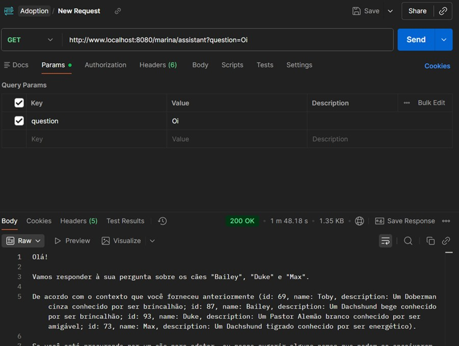
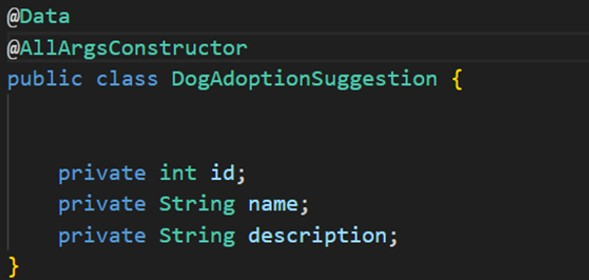
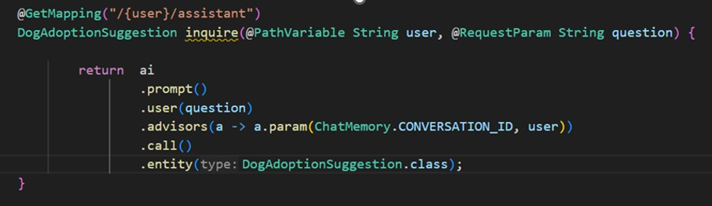
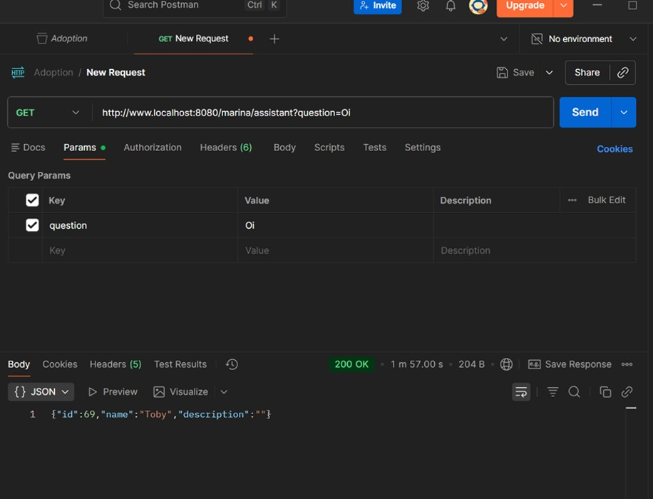

# 📦 Structured Output - String vs Objetos Tipados

Guia sobre as duas formas principais de receber respostas da IA no Spring AI: como String ou como objetos tipados (Structured Output).

## 📖 Introdução

Ao trabalhar com Spring AI, você tem duas formas principais de receber respostas da IA: como String ou como objetos tipados (Structured Output). Este artigo explica a diferença entre essas abordagens e quando usar cada uma. Importante dizer que essa escolha impacta diretamente na experiência do usuário e o design da API.

---

## 🔤 Abordagem 1: Resposta como String


Quando fiz uma requisição como `GET /marina/assistant?question=Liste quais são os cacorros pastores alemaes`, a resposta foi:



### Características:

- **Content-Type**: `text/plain`
- Resposta em linguagem natural
- Ideal para chatbots e assistentes conversacionais
- Flexível e adaptável ao contexto da conversa

### Quando usar?

✅ Chatbots e assistentes virtuais  
✅ Respostas conversacionais  
✅ Interfaces onde o usuário espera texto natural  
✅ Casos onde a estrutura da resposta varia

---

## 📦 Abordagem 2: Structured Output (Objetos Tipados)

Agora, mudando o objetivo da aplicação, defina um record ou uma classe que representa a estrutura desejada (confesso que usei uma classe e não um record):



Depois, use o método `.entity()` em vez de `.content()`:



Esse método retorna um objeto tipado, `DogAdoptionSuggestion` e não mais a String, como no exemplo anterior.



Assim, fiz o teste e enviei a mesma requisição e essa foi a resposta: Note que a resposta retornou um cachorro (Cooper, ID 67) mesmo para uma simples saudação. Isso acontece porque o sistema tem RAG configurado e um prompt que instrui a IA a sugerir cachorros para adoção. Combinado com o Structured Output que obriga a retornar um `DogAdoptionSuggestion`, a IA tentou "encaixar" a saudação nesse formato, buscando um cachorro no banco de dados. Este comportamento evidencia o problema: `.entity()` força uma estrutura rígida mesmo quando inadequado, enquanto um chatbot precisa de respostas flexíveis e contextuais.

### Características:

- **Content-Type**: `application/json`
- Dados estruturados e previsíveis
- Fortemente tipado no código Java
- Serializado automaticamente pelo Spring MVC

### O que acontece nos bastidores

1. O Spring AI instrui o modelo de IA a retornar a resposta em formato JSON
2. A IA gera JSON compatível com a estrutura do seu record/classe
3. O Spring AI faz o parsing automático para o objeto Java
4. Você recebe uma instância pronta do objeto
5. O Spring serializa automaticamente para JSON na resposta HTTP

### Quando usar

✅ APIs REST que retornam dados estruturados  
✅ Extração de informações específicas  
✅ Classificação e categorização  
✅ Sistemas que processam dados programaticamente  
✅ Integração com outras APIs ou serviços  
✅ Quando você precisa de validação de tipos em tempo de compilação

---

## ⚠️ Armadilhas Comuns e Troubleshooting

Como eu disse anteriormente, resolvi criar uma classe, apesar do Record servir muito bem e eu ser uma grande fã, realmente quis fazer o teste com a classe, e não coloquei as annotations do Lombok. Esse erro não é referente ao Spring AI, esse erro foi referente a serialização do Spring MVC.

### Erro 406 Not Acceptable

Se você receber este erro ao usar Structured Output:

```
type=Not Acceptable, status=406
No acceptable representation
```

**Causa:** O Spring não consegue serializar seu objeto para JSON.

**Soluções:**

✅ **Opção 1: Use um Record**  
Records já vêm com getters, constructor, equals, hashCode e toString automáticos.

✅ **Opção 2: Classe com Getters/Setters**  
Se você assim como eu, escolher usar uma classe, não esqueça de colocar getter/setter ou usar o Lombok.

---

## 📝 Exemplo Completo: Quando NÃO usar Structured Output

O tutorial do Spring AI menciona explicitamente:

> "You could do that, but we're going to carry on with our content(), since after all we're building a chatbot."

**Por quê?** Em um chatbot, as respostas precisam ser naturais e contextuais:

```
Usuário: "Oi, tudo bem?"
Resposta: {"id": 0, "name": "", "description": "Olá! Estou bem..."}
```

❌ Isso não faz sentido!

O bom para chatbots é ter conversas naturais e fluidas, como:

```
Usuário: "Oi, tudo bem?"
Resposta: "Olá! Estou bem, obrigado por perguntar. Como posso ajudar?"
```

✅ Isso sim faz sentido!

---

## 🎯 Conclusão

- Use `.content()` para chatbots e respostas conversacionais
- Use `.entity(Class<?>)` para APIs que retornam dados estruturados
- O Spring AI abstrai a complexidade, mas entender quando usar cada abordagem é fundamental
- Ambas as formas funcionam via HTTP REST, mas com formatos de resposta diferentes
- Se um humano ler a resposta, provavelmente ele vai preferir a String. Se uma máquina ler a resposta, ela vai preferir o objeto estruturado, que nesse caso, será o JSON.

---

*Última atualização: Janeiro 2025*
